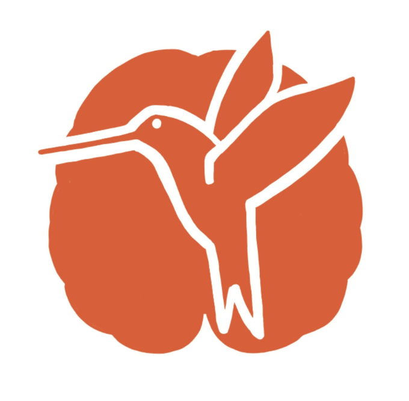

<div align="center">
  
</div>


# Nektar Alcohol Database 

The Nektar Alcohol Database is a free, open-access collection of **730 images** — 679 alcohol-related and 51 neutral. All images were sourced from open, free-to-use photo repositories (Creative Commons licenses) and selected to represent a broad range of alcohol-associated content. Images are categorized by alcohol type (e.g., wine, beer, spirits) and further subdivided by context, such as social settings, food pairings, pouring scenes, and branding. The database has been rated, tested, and validated by **324 alcohol-using participants**, each of whom evaluated a subset of images tailored to their preferred alcohol type. These ratings show that the Nektar stimuli span a wide continuum on the dimensions of **craving** and **valence**, capturing both low- and high-intensity responses. Because of this broad intensity range, the Nektar Alcohol Database is particularly well suited for studies investigating cue-induced behavior, craving, and neural responses across a large dynamic spectrum.

This page provides access to:

- the **image-level craving and valence ratings (M and SD) and metadata** (CSV)
- the **image files** (ZIP archive)


## 🔗 Downloads

- **Ratings & metadata (CSV):** [nektar_image_ratings.csv](https://github.com/floramouj/nektar/releases/download/v1.0.0/nektar_image_ratings.csv)

- **All images (ZIP):** [nektar_images.zip](https://github.com/floramouj/nektar/releases/download/v1.0.0/nektar_images.zip)


## Images

The Nektar Alcohol Database is a curated image database of alcohol-related and neutral cues with ratings of **craving** and **valence**.  
The dataset contains **730 images** across the following main categories:

```
beer              (n = 205)  
wine              (n = 192)  
spirits           (n = 195)  
general_alcohol   (n = 87)  
neutral           (n = 51)  
```
Alcohol images were also qualitatively assigned to the following distinct content categories:  
```
social_setting          (n = 131)  
pouring                 (n = 79)  
holiday_setting         (n = 60)  
negative_context        (n = 60)  
branding                (n = 60)  
food_setting            (n = 58)  
people_drinking         (n = 54)  
closeup                 (n = 41)  
opening_drink           (n = 30)  
smoking_context         (n = 29)  
social_food             (n = 28)  
drinking_setting        (n = 21)  
cocktail_preparation    (n = 15)  
holiday_food            (n = 7)  
supermarket_setting     (n = 6)  
```

## Participants
Nektar Alcohol Database images were rated by 324 alcohol drinkers (M age = 29.6 ± 14 years; 46% male, 52% female, 2% non-binary) who each rated a subsample of the dataset based on their preferred type of alcohol. Participants were recruited from the community via Instagram. Inclusion criteria were: age 18–65, German-speaking, and a score of  ≥4 on AUDIT items 1–3, ensuring current alcohol use. 

## Reference
More detailed information on image ratings and image-evoked brain activity is described in our forthcoming paper:

Moujaes, F.†, Engeli, E. E.†, et al. (under review). *A validated alcohol-cue stimulus bank for alcohol use disorder: Personalized fMRI craving modeling converges on the anterior cingulate cortex.*  
†Joint first authors.

A link to the published article will be added once available. The Nektar Alcohol Database is already accessible. 

## Contact 
Please contact us for any questions (etna.engeli@bli.uzh.ch, flora.moujaes@bli.uzh.ch). Further, we are happy to include any additional ratings from your own studies in the here presented overall ratings.


<div align="center">
  
</div>


<div align="center">
  
</div>

